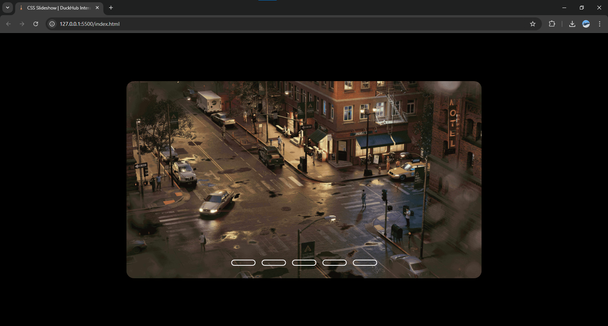
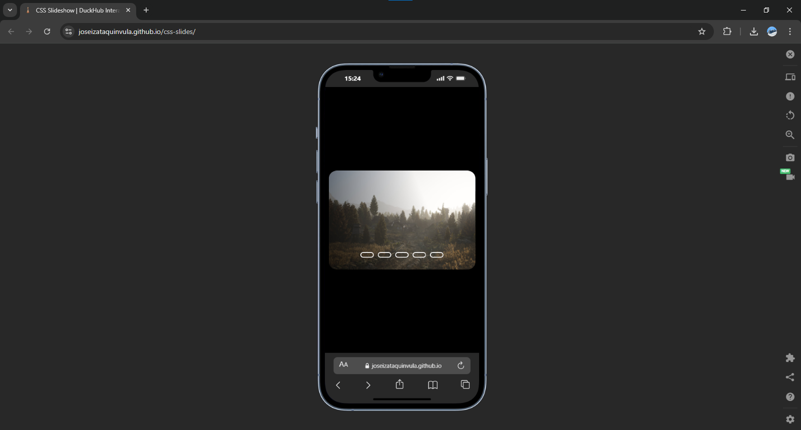

# CSS Slideshow - DuckHub Interactive Display

Este repositório contém o código-fonte de um Slideshow interativo desenvolvido exclusivamente com HTML5 e CSS3. O projeto foi estruturado para demonstrar o potencial de seletores avançados e lógica de estado sem a necessidade de scripts externos ou JavaScript.

## Visão Geral

O Slideshow funciona através do controle de estados de inputs radio e seletores de irmãos adjacentes (~). A arquitetura foi planejada para garantir uma navegação fluida, focada em performance nativa e transições suaves, ideal para portfólios e exibições de ativos estáticos.

---

## Arquitetura de Pastas

A organização do diretório segue o padrão de separação de responsabilidades do DuckHub:

* **Raiz:** Ponto de entrada (`index.html`), metadados de SEO e rastreamento (GA).
* **assets/css:** Lógica de estilização, transições e regras de responsividade.
* **assets/imgs:** Armazenamento das imagens do slider (`slide-01.jpg` a `slide-05.jpg`).

---

## Especificações Técnicas

O desenvolvimento priorizou o uso de recursos nativos do navegador para minimizar o tempo de carregamento (LCP):

* **Estrutura:** HTML5 Semântico com lógica de controle via inputs.
* **Estilização:** CSS3 puro, utilizando `flexbox` e `object-fit` para gestão de imagem.
* **Interatividade:** Sistema de transição via `margin-left` e `cubic-bezier`.
* **Rastreamento:** Google Analytics integrado para monitoramento de tráfego.

---

## Demonstração da Interface

### Interface Desktop



### Interface Mobile



---

## Procedimentos de Instalação

Para replicar o ambiente de desenvolvimento localmente, siga os passos abaixo:

1. Clone o repositório:

```bash
git clone [https://github.com/JoseIzataQuinvula/css-slides.git](https://github.com/JoseIzataQuinvula/css-slides.git)

cd css-slides

2. Execução: O projeto é estático e independente de dependências externas. Basta abrir o arquivo index.html em qualquer navegador moderno.

